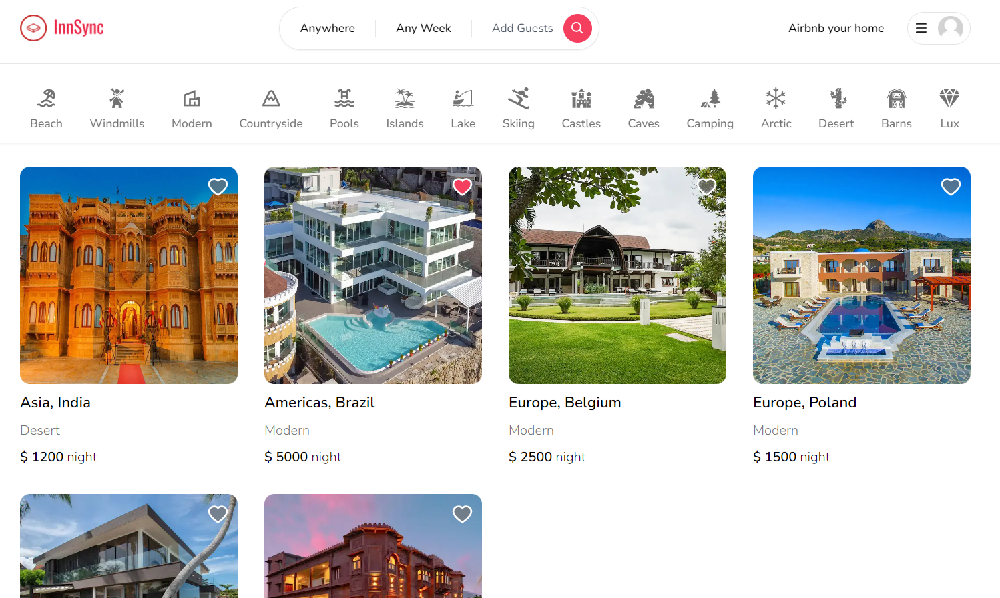
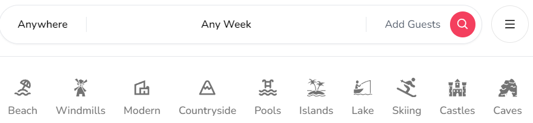
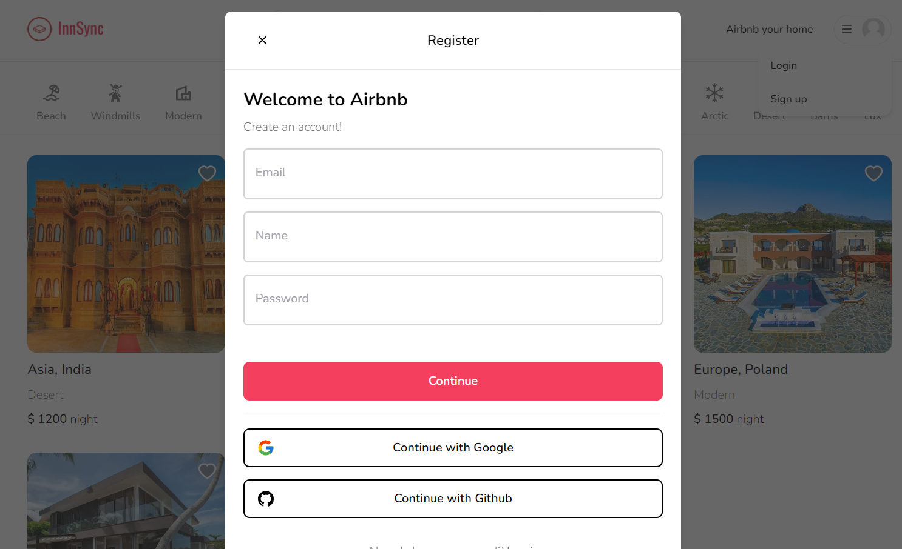
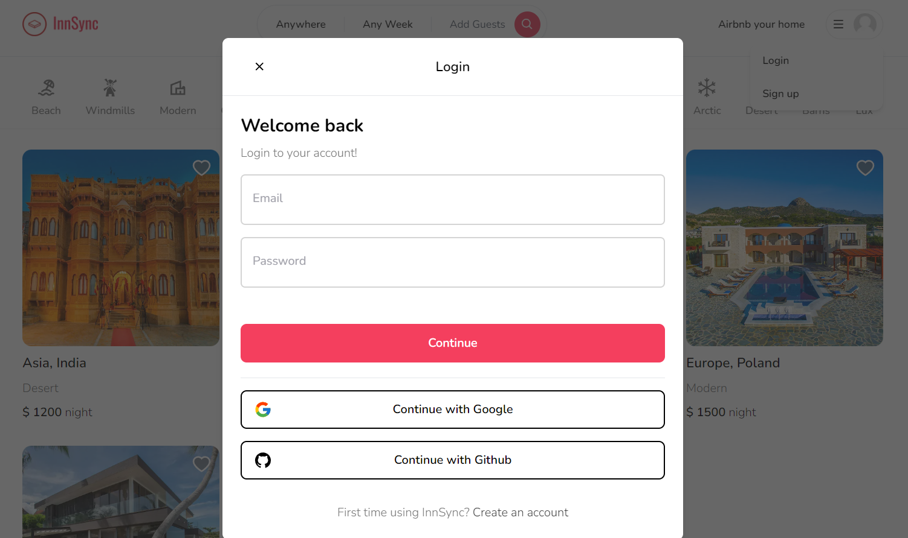
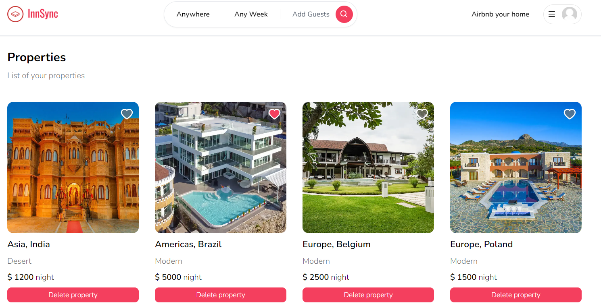

# Innsync Reservation Portal - MERN

<center></center>

This is a repository for a Full Stack Airbnb Clone with Next.js 13 App Router: React, Tailwind, Prisma, MongoDB, NextAuth.

#### Features:

- Tailwind design
- Tailwind animations and effects
- Full responsiveness
- Credential authentication
- Google authentication
- Github authentication
- Image upload using Cloudinary CDN
- Client form validation and handling using react-hook-form
- Server error handling using react-toast
- Calendars with react-date-range
- Page loading state
- Page empty state
- Booking / Reservation system
- Guest reservation cancellation
- Owner reservation cancellation
- Creation and deletion of properties
- Pricing calculation
- Advanced search algorithm by category, date range, map location, number of guests, rooms and bathrooms
  - For example we will filter out properties that have a reservation in your desired date range to travel
- Favorites system
- Shareable URL filters
  - Lets say you select a category, location and date range, you will be able to share URL with a logged out friend in another browser and they will see the same results
- How to write POST and DELETE routes in route handlers (app/api)
- How to fetch data in server react components by directly accessing database (WITHOUT API! like Magic!)
- How to handle files like error.tsx and loading.tsx which are new Next 13 templating files to unify loading and error handling
- How to handle relations between Server and Child components!

### Output Screenshots

#### 01. Homescreen Page

This is the homescreen/landing page of our application, where thte user will be redirected when he gets visit for the first-time. This is a image of that page.


#### 02. Location / Category based Fiteration

As you can see, our application contains dynamic filteration option, where a user can filter the place according to the category as well as location.


#### 03. Login & Registration Page

This is the login and registration page of the application where a user can easily get him/herself register and user the application. And apart from the the application also contains Google sign-in option



#### 04. Properties Section

In this section a user can manage the properties which is listed by him. In this Menu the user can delete the properties whenever he want


### Prerequisites

**Node version 14.x**

### Install packages

```shell
npm i
```

### Setup .env file

```js
DATABASE_URL=
GOOGLE_CLIENT_ID=
GOOGLE_CLIENT_SECRET=
GITHUB_ID=
GITHUB_SECRET=
NEXTAUTH_SECRET=
```

### Setup Prisma

```shell
npx prisma db push

```

### Start the app

```shell
npm run dev
```
